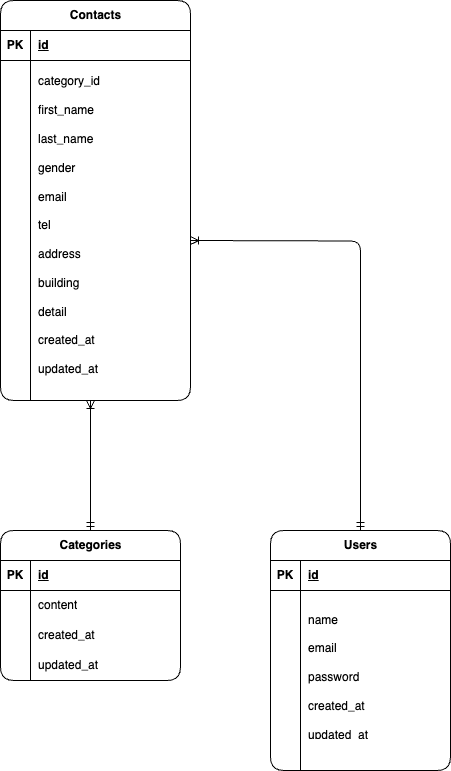

# laravel-docker-template

##　環境構築

Dockerビルド
・git clone git@github.com:hashimo537/testcontact-form.git

## 環境構築手順
・docker-compose exec php bash
・composer install
・cp .env.example .env、環境変数を適宜変更
・php artisan key:generate
・php artisan migrate
・php artisan db:seed
・docker-compose.ymlのmysql部分へplatform: linux/amd64追加

環境構築
・お問い合わせ画面：http://localhost
・ユーザー登録：http://localhost/admin
・phpMyAdmin:http://localhost:8080/

## 使用技術(実行環境)

・PHP 8.1（php:8.1-fpm）
・Laravel 8.x（composer管理）
・MySQL 8.0.26（Docker）
・nginx 1.21.1（Docker）

## ER図

